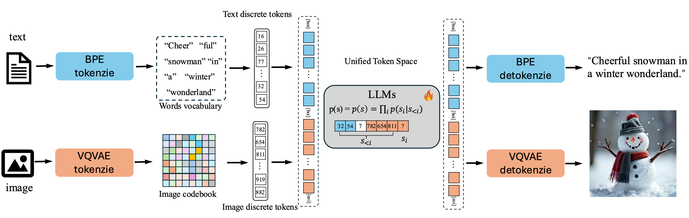

<div align="center">
<h1>Liquid: Language Models are Scalable and Unified <br> Multi-modal Generators</h1>

[**Junfeng Wu**](https://wjf5203.github.io/)<sup>1,2</sup> · [**Yi Jiang**](https://enjoyyi.github.io/)<sup>2&dagger;</sup> · [**Chuofan Ma**](https://machuofan.github.io/)<sup>2,3</sup>
<br>
[**Yuliang Liu**](https://openreview.net/profile?id=~Yuliang_Liu2)<sup>1</sup> · [**Hengshuang Zhao**](https://hszhao.github.io/)<sup>3</sup>
<br>
[**Zehuan Yuan**](https://shallowyuan.github.io/)<sup>2</sup> · [**Song Bai**](https://songbai.site/)<sup>2*</sup> · [**Xiang Bai**](http://vlrlab.aia.hust.edu.cn/)<sup>1*</sup>

<sup>1</sup>HUST&emsp;&emsp;&emsp;<sup>2</sup>ByteDance&emsp;&emsp;&emsp;<sup>3</sup>HKU
<br>
&dagger;project lead&emsp;&emsp;&emsp;*corresponding author

<a href="https://arxiv.org/abs/2412.04332"></a>
<a href="https://foundationvision.github.io/Liquid/"></a>
<a href="https://huggingface.co/Junfeng5/Liquid_V1_7B"></a>
<a href="https://huggingface.co/spaces/Junfeng5/Liquid_demo"></a>


</div>

<font size="4">This repo implements Liquid, a scalable and unified autoregressive generation paradigm that seamlessly integrates multimodal comprehension and generation.</font>




## News
**2025-02-28:** Paper, demo, model, and [project page](https://foundationvision.github.io/Liquid/) for Liquid are all released.

## 📑 Open-Source Plan

- Liquid-7B (Mix-pretrained Multimodal Model with T2I and Language Ability)
  - [ ] Web Demo 
  - [ ] Inference 
  - [ ] Checkpoints
- Liquid-7B-Multiratio (Multi-Ratio Image Generation Model)
  - [ ] Web Demo 
  - [ ] Inference 
  - [ ] Checkpoints
- Liquid-7B-IT (Instruction Tuned Multimodal Model with Instruction Following Ability)
  - [ ] Web Demo 
  - [ ] Inference 
  - [ ] Checkpoints

## 📖 Introduction
* We present Liquid, an auto-regressive generation paradigm that **seamlessly integrates visual comprehension and generation.**

* Unlike previous multimodal large language model (MLLM), Liquid achieves this integration using a single large language model (LLM), eliminating the need for external pretrained visual embeddings such as CLIP. 

* For the first time, Liquid uncovers a **scaling law** that performance drop unavoidably brought by the unified training of visual and language tasks diminishes as the model size increases.

* Furthermore, the unified token space enables visual generation and comprehension tasks to **mutually enhance each other**


## 🔥 Multimodal Generation
* <font size="4">Liquid : Scalable and Versatile Unified Multimodal Generator which supports Visual Understanding, Visual Generation and Multi-modal Generation</font>


* <font size="4">Liquid can generate high-quality, photorealistic images of any aspect ratio by language in an autoregressive paradigm.</font>


## 🔥 Scaling Law for multimodal generation
* <font size="4">Liquid shows clear Scaling Law in multimodal generation across different sizes(0.5B to 32B).</font>


## License
This project is licensed under the MIT License - see the [LICENSE](LICENSE) file for details.

## Citation

If you find this project useful, please consider citing:

```bibtex
@article{liquid,
  title={Liquid: Language Models are Scalable and Unified Multi-modal Generators},
  author=author={Wu, Junfeng and Jiang, Yi and Ma, Chuofan and Liu, Yuliang and Zhao, Hengshuang and Yuan, Zehuan and Bai, Song and Bai, Xiang},
  journal={arXiv preprint arXiv:2412.04332},
  year={2024}
}
```